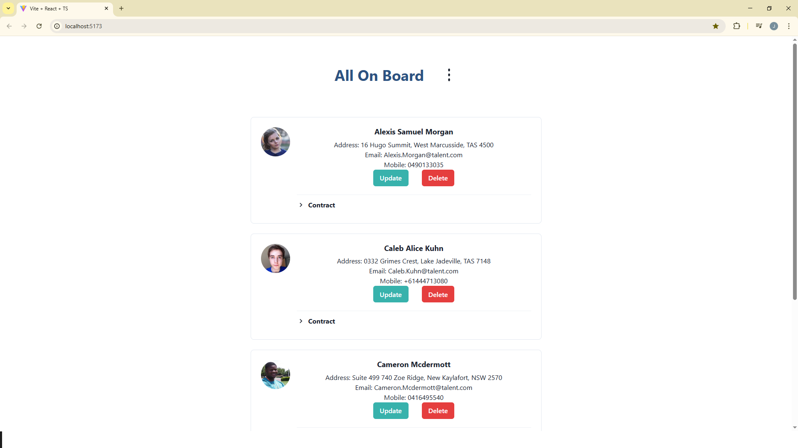
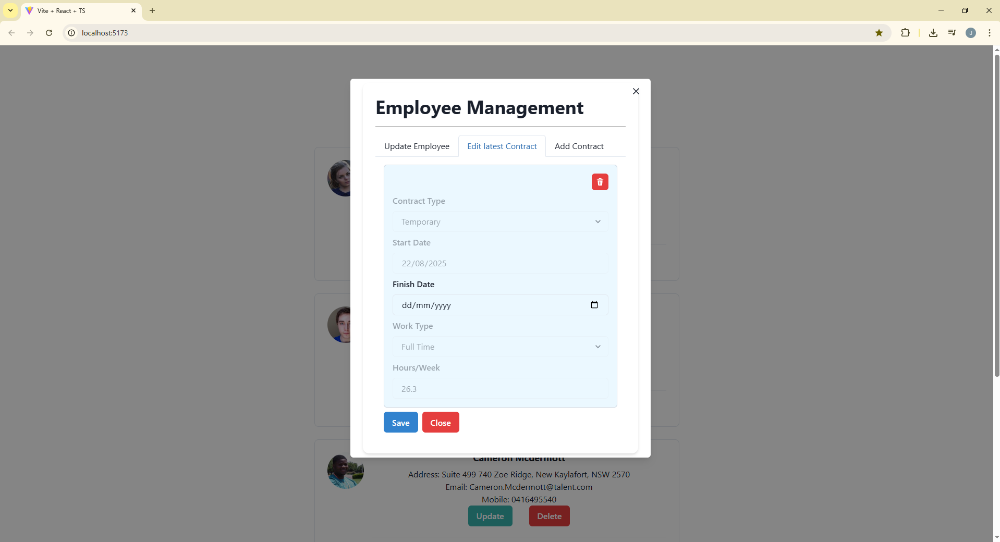
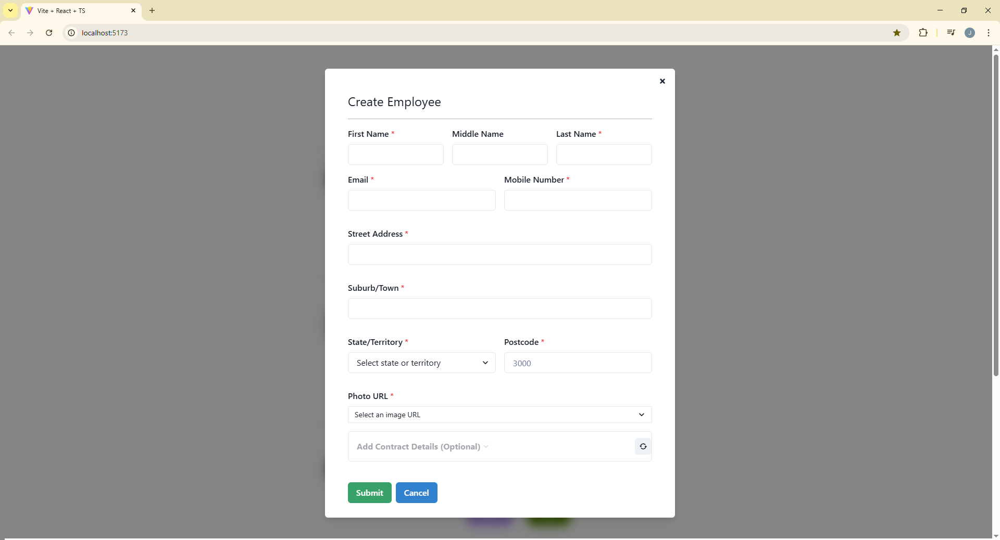
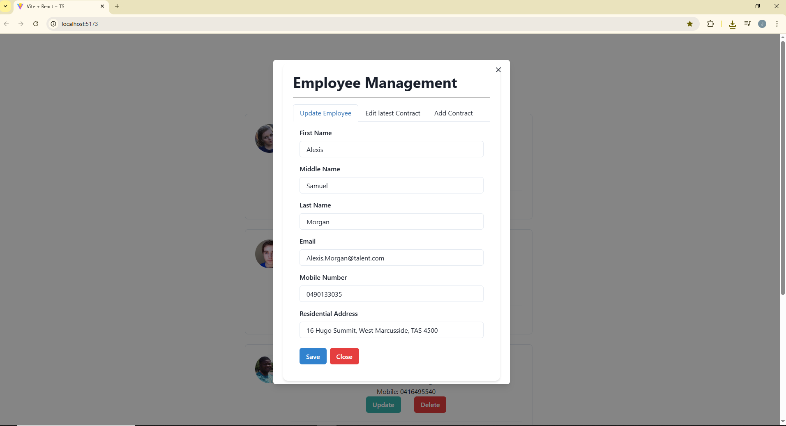
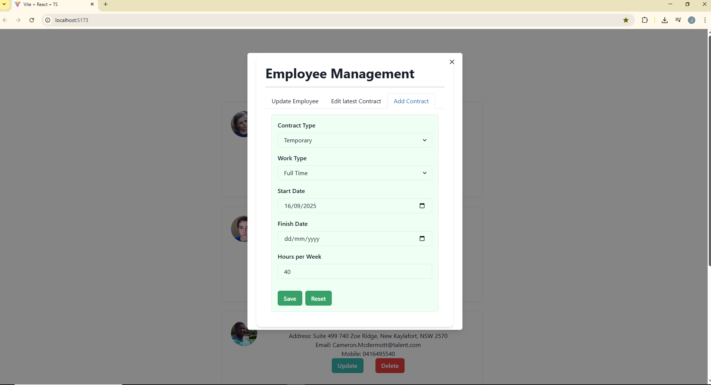
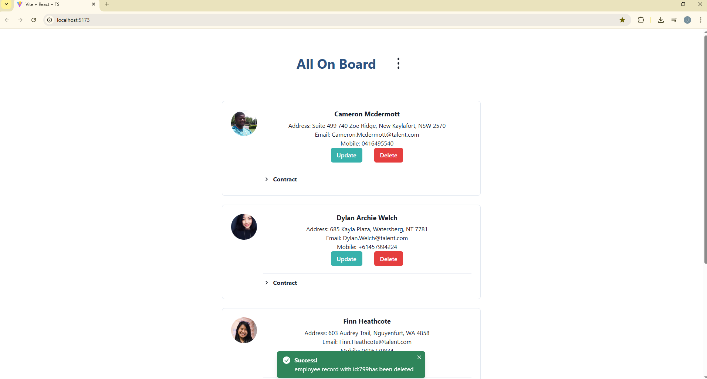
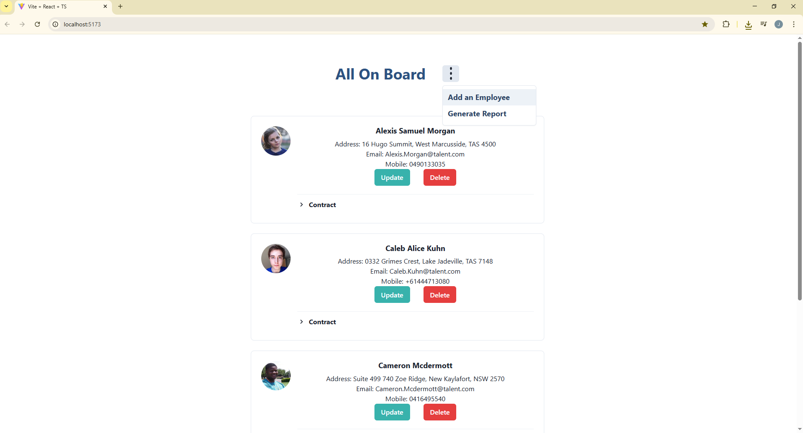

# Employee Management Web Application

A full-stack web application to **create, list, modify, and delete employees**. The project uses **React TypeScript** with **ChakraUI** for the frontend, and a **Spring Boot Java REST API** with **MySQL** for the backend. It also includes schema validation, logging, and testing frameworks.

**Project Board & Tasks:** [JIRA CCS Board](https://janitech2025.atlassian.net/jira/software/projects/CCS/boards/1)

---

## Table of Contents

- [Features](#features)
- [Tech Stack](#tech-stack)
- [Project Structure](#project-structure)
- [Getting Started](#getting-started)
- [Backend API](#backend-api)
- [Testing](#testing)
- [Logging](#logging)
- [Project Management](#project-management)
- [License](#license)

---

## Features

- Create, view, update, and delete employee records
- Employee data validated using **Zod schemas** on the frontend
- **RESTful API** with Spring Boot
- **MySQL database** for persistence
- **End-to-end tests** using JUnit and Mockito
- Clean and responsive UI built with **ChakraUI**
- Logging with **SLF4J**
- Modular and maintainable architecture

---

## Tech Stack


---

## Project Structure

backend/
├─ src/main/java/com/example/employee
│ ├─ controller/
│ ├─ service/
│ ├─ repository/
│ ├─ entity/
│ ├─ dto/
│ └─ mapper/
└─ src/test/java/com/example/employee
└─ ... (JUnit & Mockito tests)

frontend/
├─ src/
│ ├─ components/
│ ├─ pages/
│ ├─ hooks/
│ ├─ services/
│ └─ validation/ (Zod schemas)
└─ package.json

## UI Design inspirations

https://janitech2025.atlassian.net/wiki/spaces/CCS/pages/2064386/UI+design+inspirations

## Employee Creator UI snapshots

### Employee List Page



### List contracts and highlight active contract



### Create Employee Form



### Edit Employee Details



### Add contract to employee



### Update Recent contract details


### Delete employee record and display toast message



### Generate employee report



## Getting Started

1. Clone the repository:

   ```bash
   git clone <repo-url>

   ```

2. Backend: configure MySQL database in application.properties

3. Backend: build and run:
   mvn clean install
   mvn spring-boot:run

4. Frontend: install dependencies and start:
   cd frontend
   npm install
   npm start

5. Access the web app at http://localhost:5173
   Backend runs at http://localhost:8080

## Environment Variables

The application requires the following environment variables to be set for proper configuration of the database and Cloudinary image uploads. You can create a `.env` file in the root directory or set them in your system environment.

| Variable      | Description                                    |
| ------------- | ---------------------------------------------- |
| `DB_NAME`     | Name of the MySQL database                     |
| `DB_USERNAME` | MySQL database username                        |
| `DB_PASSWORD` | MySQL database password                        |
| `CLOUD_NAME`  | Cloudinary cloud name                          |
| `API_KEY`     | Cloudinary API key                             |
| `API_SECRET`  | Cloudinary API secret                          |
| `FOLDER_NAME` | Cloudinary folder name where images are stored |

## API Endpoints

| Operation       | HTTP Method & Endpoint                          | Description                                 |
| --------------- | ----------------------------------------------- | ------------------------------------------- |
| Create Employee | `POST /employees`                               | Add a new employee.                         |
| List Employees  | `GET /employees`                                | Retrieve a list of all employees.           |
| Update Employee | `PUT /employees/{id}`                           | Update details of an existing employee.     |
| Delete Employee | `DELETE /employees/{id}`                        | Remove an employee by ID.                   |
| Add Contract    | `POST /employees/{id}/contracts`                | Add a new contract for an employee.         |
| Update Contract | `PUT /employees/{id}/contracts/{contractId}`    | Update an existing contract of an employee. |
| Delete Contract | `DELETE /employees/{id}/contracts/{contractId}` | Delete a contract for an employee.          |

# Testing

Unit & Integration Tests: JUnit 5
Mocking: Mockito
End-to-End REST Tests: RestAssured

# Logging

SLF4J is used for logging across backend services
